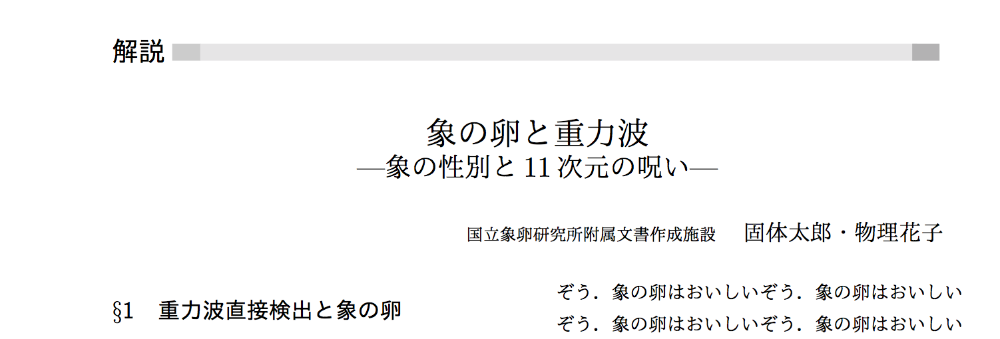
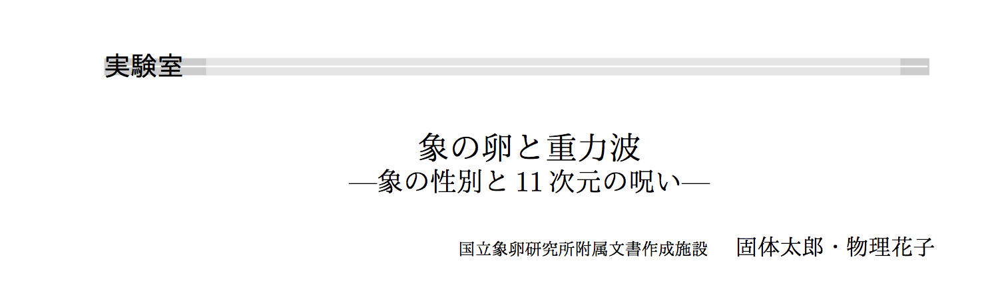
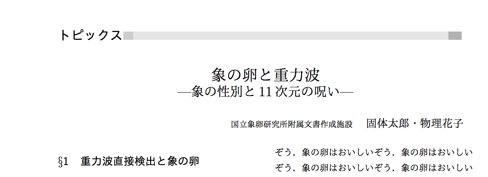
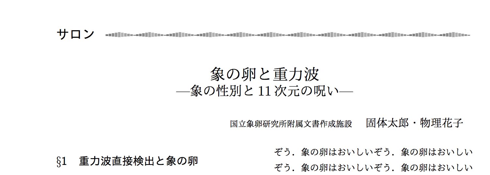

# 「固体物理」スタイルファイル

アグネ技術センターから発行されている雑誌「[固体物理](http://www.agne.co.jp/kotaibutsuri/)」のためのスタイルファイルです。

# 本スタイルファイルについて

本スタイルファイルは、「固体物理」編集部の許可を得て私的に公開をするものです。本スタイルファイルについて「固体物理」編集部に問い合わせることはご遠慮ください。

# 使い方

同封の`sample.tex`を編集して`make`するのが楽だと思います。サンプル、スタイルファイルともに文字コードがUTF-8になっているので、適宜環境に併せて修正してください。

## スタイルオプション

現在、「解説」「実験室」「トピックス」「サロン」の4種類に対応しています。デフォルトでは「解説」が選択されます。その他のスタイルに変更する場合は、`\documentclass`のオプションに`topic`、`jikkensitsu`、`salon`などを指定してください。ただし、このオプションによって変わるのはヘッダー画像のみです。それぞれ以下のようなヘッダになります。

* 「解説」 

* 「実験室」 

* 「トピックス」 

* 「サロン」 

## タイトル

`\title`によるタイトルに加え、`\subtitle`でサブタイトルをつけることができます。サブタイトルは任意です。

## 著者情報
著者名を`\author`で、所属を`\affiliation`で指定できます。

## 雑誌情報

以下のコマンドにより、ボリュームや通算ページ数、ナンバーなどを指定できます。指定は任意ですが、指定するとそれっぽくなります。

* `\startpage` スタートページ
* `starttotalpage` 通算スタートページ
* `\articlevolume` ボリューム
* `\articlenumber` ナンバー
* `\articleyear` 発行年

## その他

図の引用は、通常どおり`\ref{label}`コマンドで行えますが、`\bref{label}`とすると「**第1図** 」と出力されてちょっと便利です。

## 要望その他

要望などがありましたら適宜forkして修正していただければと思いますが、もし何か作者に連絡したいことがあれば

kaityo_at_users.sourceforge.jp

までご連絡ください。
